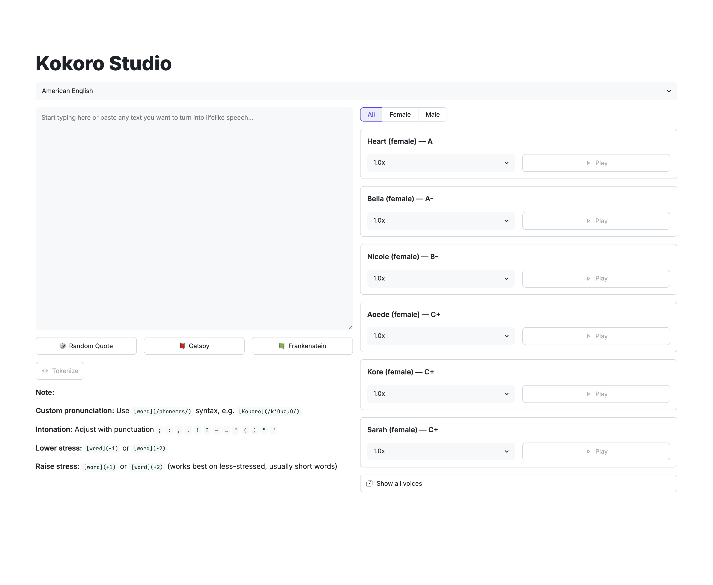
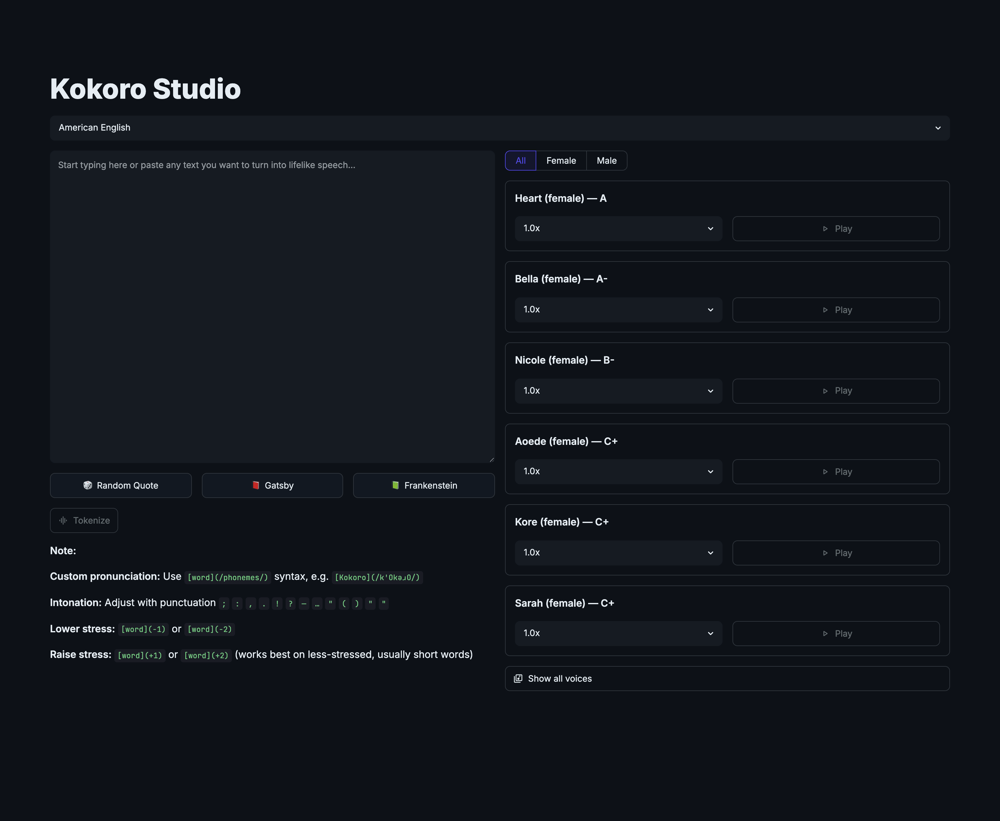

# Kokoro Studio

*Private, on-device text-to-speech for Apple Silicon — nine languages, dozens of graded voices, fully offline after a one-time download.*

[](https://github.com/darylalim/kokoro-studio/actions/workflows/ci.yml)
[](LICENSE)
[](https://www.python.org/downloads/)


Streamlit application for generating multilingual speech using [Hexgrad Kokoro](https://huggingface.co/hexgrad/Kokoro-82M) on Apple Silicon with MLX.

<p align="center">
  
  
</p>

## Why Kokoro Studio

- **Fully offline & private** — after a one-time ~355 MB download, nothing leaves your Mac: no API keys, no network calls, no usage caps.
- **On-device Apple Silicon** — runs natively through Apple's [MLX](https://github.com/ml-explore/mlx), with no PyTorch or MPS fallback.
- **Nine languages, dozens of voices** — voices are sorted by quality grade so the strongest options surface first.
- **Built for comparison** — generate several voices on the same text and A/B them inline, each at its own playback speed.

> **Requires an Apple Silicon Mac (M1 or newer).** MLX is Apple-Silicon-only, so installation will fail to resolve on Intel macOS, Linux, or Windows.

## Contents

- [Features](#features)
- [Requirements](#requirements)
- [Installation](#installation)
- [Usage](#usage)
- [How it works](#how-it-works)
- [Troubleshooting](#troubleshooting)
- [Development](#development)
- [License](#license)

## Features

**Languages & voices**

- Nine languages: American & British English, Spanish, French, Hindi, Italian, Japanese, Brazilian Portuguese, and Mandarin Chinese.
- Voice cards sorted by quality grade (best first). The grade is shown in the title where the model card provides one (e.g. "Heart (female) — A"); ungraded voices (Spanish and Brazilian Portuguese) show just "Name (gender)" and sort after the graded ones. The top 6 are visible, the rest sit behind a "Show all voices" expander.
- Gender filter via a single segmented control (All / Female / Male), defaulting to All.

**Generation & playback**

- Per-card Play button generates audio on demand and embeds an inline player — play multiple cards to A/B-compare voices on the same text. Each card reruns on its own, so playing one voice or changing its speed never reloads the whole page.
- Per-card speed control (0.7x–1.5x in 0.1 steps); a speaker icon marks voices with cached audio, and changing speed keeps the previous clip visible until you press Play again.
- Per-card Download button for the generated WAV.
- Chunk-by-chunk generation progress while a clip is being synthesized.
- Light and dark themes with a toolbar toggle.

**Privacy & offline**

- One-time model + voice download on first launch (~355 MB); fully offline thereafter.

**Text & pronunciation tools**

- Per-language sample buttons to seed the text box with public-domain reference text: a localized random-quote button (e.g. "🎲 Random Quote" in English, "🎲 古语" in Chinese) plus two literary excerpts.
- Tokenize button to preview the phoneme tokens before synthesizing.
- Utterance-length caption under the text box, color-coded against [VOICES.md](https://huggingface.co/hexgrad/Kokoro-82M/blob/main/VOICES.md) bands (very short / short / ideal / long / will-be-chunked).
- Always-visible pronunciation note with Kokoro-specific syntax (custom phonemes, stress, intonation).

## Requirements

- macOS with Apple Silicon (M1 or newer)
- Python 3.12+
- [uv](https://docs.astral.sh/uv/) — install with `curl -LsSf https://astral.sh/uv/install.sh | sh`
- [espeak-ng](https://github.com/espeak-ng/espeak-ng)

## Installation

```bash
# 1. System dependency (via Homebrew)
brew install espeak-ng

# 2. Python dependencies, then launch
uv sync
uv run streamlit run streamlit_app.py
```

The app opens at <http://localhost:8501>. On first launch it downloads the model and voices once (~355 MB, shown with a spinner); the model itself also loads on your first Play. After the initial download it runs fully offline. Press `Ctrl+C` in the terminal to stop it.

> **Note:** The spaCy model `en_core_web_sm` (required for English G2P) is installed automatically by `uv sync`.

### Japanese support (optional)

Japanese G2P needs the UniDic dictionary, a one-time ~1 GB download. Skip this unless you plan to use Japanese:

```bash
uv run python -m unidic download
```

## Usage

1. Pick a language from the selector at the top.
2. Type or paste text into the box — or click a sample button (a random quote plus two literary excerpts) to seed it.
3. *(Optional)* Click **Tokenize** to preview the phoneme tokens. The colored caption tells you whether the text is too short, ideal length, or long enough to be chunked.
4. *(Optional)* Filter the voices by gender (All / Female / Male).
5. Pick a voice card — the top 6 by quality grade are shown directly, with the rest behind **Show all voices**.
6. Choose a playback speed (0.7x–1.5x).
7. Click **Play**. Generation progress appears inline, and the audio player shows up in the card when it's done.
8. Play other cards to A/B-compare voices on the same text (a speaker icon marks cards that already have audio), and use **Download** to save any clip as a WAV.

> **Tip:** For custom pronunciation, use the in-app syntax — e.g. `[Kokoro](/kˈOkəɹO/)`. See the **Note** panel in the app for stress and intonation controls.

## How it works

Kokoro Studio is a thin Streamlit front-end over the [`mlx-community/Kokoro-82M-bf16`](https://huggingface.co/mlx-community/Kokoro-82M-bf16) MLX model (82M params, bf16, 24 kHz).

**Synthesis path.** Your raw text and the selected language code go straight into the mlx-audio Kokoro pipeline, which performs grapheme-to-phoneme (G2P) conversion and vocoding internally and streams audio chunks back:

```
text + language code  →  MLX Kokoro pipeline (internal G2P + vocoding)  →  audio chunks
```

The **Tokenize** button and the length caption run a *separate* `misaki` / `espeak-ng` G2P purely to **display** phoneme tokens and estimate length — those phonemes are not fed back into the model.

**Other notable pieces:**

- **Offline-first** — `snapshot_download` fetches the model and all voices once; afterward, voice discovery is just a local filesystem walk.
- **Fragment-scoped reruns** — each voice card is an `st.fragment`, so a Play or speed change reruns only that card. Generated audio is cached in session state (bounded, oldest-evicted) so unrelated interactions don't regenerate it.

For a full file-by-file map, a function reference, and design notes, see [CLAUDE.md](CLAUDE.md).

## Troubleshooting

| Symptom | Fix |
| --- | --- |
| "Could not download the Kokoro model" on first launch | The one-time ~355 MB fetch needs internet. Check your connection and reload. |
| Japanese errors or produces no audio | Run `uv run python -m unidic download` (one-time, ~1 GB). |
| English or Romance-language voices error on Play | Install the system dependency: `brew install espeak-ng`. |
| `uv sync` fails to resolve / won't install | You're not on Apple Silicon. MLX requires an Apple Silicon Mac; Intel macOS, Linux, and Windows are unsupported. |
| Port already in use | `uv run streamlit run streamlit_app.py --server.port 8502` |
| Source edits don't auto-reload | The file watcher is disabled (`fileWatcherType = "none"`); restart the app or use the toolbar's **Rerun**. |

## Development

```bash
uv sync --group dev          # install dev tooling (pytest, ruff, ty)
uv run ruff check .          # lint
uv run ruff format .         # format
uv run ty check              # typecheck
uv run pytest                # unit tests
uv run pytest tests_integration/   # integration tests (opt-in)
```

**Contributing & CI.** CI is the merge gate on every push to `main` and every PR (runs on `macos-latest`): `ruff check`, `ruff format --check .`, `ty check`, and the unit test suite. `uv sync --locked` fails on lockfile drift, so re-run `uv lock` after changing dependencies. The integration suite is opt-in (`uv run pytest tests_integration/`) and needs the real ~355 MB download. Heads-up: CI gates on `ruff format --check .`, not the bare `ruff format .` above — format locally before pushing.

<details>
<summary><strong>Releasing</strong> (maintainers)</summary>

Pushing a `vX.Y.Z` tag publishes a GitHub Release automatically (via `.github/workflows/release.yml`), with notes generated from the commits since the previous release:

```bash
# bump `version` in pyproject.toml, then `uv lock`, commit
git push origin main                          # let CI validate the bump commit
git tag -a vX.Y.Z -m "vX.Y.Z" && git push origin vX.Y.Z
```

The workflow verifies the tag matches `pyproject.toml`'s `version` before publishing. It does **not** wait on CI, so confirm CI is green on the bump commit first.

</details>

## License

[MIT](LICENSE) © 2026 Daryl Lim

### Third-party licenses & acknowledgements

This app is a thin Streamlit front-end. At runtime it downloads and depends on third-party components under their own licenses:

- **[Kokoro-82M](https://huggingface.co/hexgrad/Kokoro-82M)** by hexgrad — the upstream TTS model (Apache-2.0). At runtime the app downloads the [`mlx-community/Kokoro-82M-bf16`](https://huggingface.co/mlx-community/Kokoro-82M-bf16) MLX conversion (a bf16 derivative, also Apache-2.0); neither is redistributed in this repository.
- The G2P stack pulls in **espeak-ng** and **phonemizer-fork** (both **GPLv3**) and **num2words** (**LGPL**). These drive phonemization for English *and* the espeak-backed languages (Spanish, French, Hindi, Italian, Brazilian Portuguese), so the GPLv3 exposure is language-agnostic, not English-only. Installing and running the app from source via `uv sync` is unaffected by these terms, but note that a *bundled, redistributed build* (e.g. a Docker image or standalone binary that vendors the GPLv3 dependencies) would be a combined work subject to **GPLv3**. num2words is LGPL, whose weaker terms don't impose GPLv3 on the larger work.

Bundled sample texts under `samples/` are public domain.
